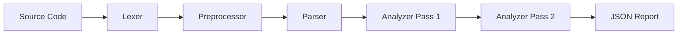

# Architecture Overview

**VBAlidator** is built as a modular static analysis pipeline using Python. It avoids regex-only parsing in favor of a proper tokenization and parsing strategy to handle nested scopes and complex VBA syntax.

## Core Components

### 1. Lexer (`src/lexer.py`)
*   **Responsibility:** Converts raw VBA source code into a stream of `Token` objects.
*   **Features:**
    *   Handles comments, strings, identifiers, and literals.
    *   Recognizes line continuations (` _`) and statement separators (`:`).
    *   Identifies Preprocessor directives (`#If`, `#Const`, `#End`).

### 2. Preprocessor (`src/preprocessor.py`)
*   **Responsibility:** Filters the token stream based on conditional compilation logic.
*   **Logic:** Maintains a stack of active/inactive states based on `#If...#Else` blocks, stripping code that would be inactive in the target environment.

### 3. Parser (`src/parser.py`)
*   **Responsibility:** Consumes tokens to build a structured Node representation (AST).
*   **Key Structures:** `ModuleNode`, `ProcedureNode`, `TypeNode` (UDT), `StatementNode`, and `WithNode`.

### 4. Analyzer (`src/analyzer.py`)
*   **Responsibility:** Performs semantic analysis on the parsed nodes.
*   **Process:**
    *   **Pass 1 (Discovery):** Scans all modules to register public variables, procedures, classes, and UDTs into the Global Symbol Table.
    *   **Pass 2 (Verification):** Walks through procedure bodies to verify logic.
        *   Creates nested local scopes for variables (`Dim`, `Const`).
        *   Maintains a `With Stack` for member resolution.
        *   Uses **Heuristics** for Form controls and special objects like `ThisDocument`.
        *   Validates all identifiers and members against the dynamic **Object Model**.

### 5. Configuration (`src/config.py`)
*   **Responsibility:** Manages the Object Model and User-defined constants.
*   **Logic:** Merges the external JSON model into the active symbol lookup table.

## Data Flow

